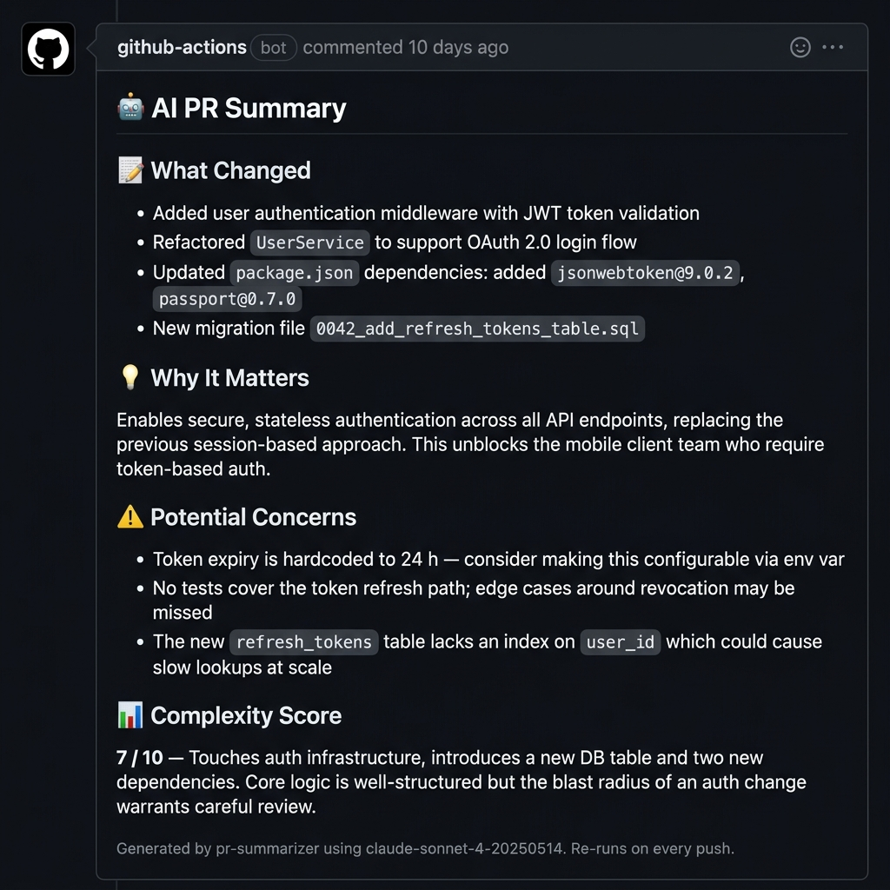

# 🤖 PR Summarizer

A GitHub Action that automatically generates a structured AI summary for every pull request using **Claude** (`claude-sonnet-4-20250514`). On each `opened` or `synchronize` event the action fetches the PR diff, sends it to the Anthropic API, and posts (or updates) a comment with:

- 📝 **What Changed** — concrete bullet-point list of modifications
- 💡 **Why It Matters** — purpose and business/technical value
- ⚠️ **Potential Concerns** — risks, edge cases, missing tests, security notes
- 📊 **Complexity Score** — 1–10 rating with a short justification

The bot is idempotent: it updates its own comment on re-runs instead of spamming new ones.

---

## Example Comment



---

## Project Structure

```
.
├── .github/
│   ├── actions/
│   │   └── pr-summarizer/
│   │       ├── action.yml      # Action metadata & inputs
│   │       ├── index.js        # Core logic (ESM)
│   │       └── package.json    # Dependencies
│   └── workflows/
│       └── pr-summary.yml      # Workflow trigger
└── README.md
```

---

## Setup

### 1. Add your Anthropic API key as a secret

Go to **Settings → Secrets and variables → Actions → New repository secret** and add:

| Secret name         | Value                                         |
|---------------------|-----------------------------------------------|
| `ANTHROPIC_API_KEY` | Your Anthropic API key (`sk-ant-…`)           |

> `GITHUB_TOKEN` is provided automatically by GitHub — no configuration needed.

### 2. Grant the workflow write permission on pull requests

Go to **Settings → Actions → General → Workflow permissions** and select  
**"Read and write permissions"**, then save.

Alternatively the permission is already declared in the workflow file:

```yaml
permissions:
  pull-requests: write
  contents: read
```

### 3. Install Node dependencies for the action

The action uses `node20` directly, so you need to commit `node_modules` **or** add an install step before using the local action.

**Option A — commit `node_modules` (simplest)**

```bash
cd .github/actions/pr-summarizer
npm install
git add node_modules
git commit -m "chore: install pr-summarizer action dependencies"
git push
```

**Option B — add an install step in the workflow**

```yaml
- name: Install action dependencies
  run: npm install
  working-directory: .github/actions/pr-summarizer

- name: Run PR Summarizer
  uses: ./.github/actions/pr-summarizer
  with:
    github-token: ${{ secrets.GITHUB_TOKEN }}
    anthropic-api-key: ${{ secrets.ANTHROPIC_API_KEY }}
```

### 4. Open a pull request

Push a branch and open a PR — the **PR Summarizer** workflow will trigger automatically.

---

## Configuration

### Changing the model

Edit the `MODEL` constant at the top of [`.github/actions/pr-summarizer/index.js`](.github/actions/pr-summarizer/index.js):

```js
const MODEL = "claude-sonnet-4-20250514";
```

Any model available via the [Anthropic Messages API](https://docs.anthropic.com/en/docs/about-claude/models) can be used.

### Adjusting the diff size limit

Very large diffs are truncated to avoid exceeding Claude's context window. The default is **30,000 characters**. Adjust `MAX_DIFF_CHARS` in `index.js` to suit your needs.

### Customising the prompt

The prompt is built in the `buildPrompt()` function in `index.js`. Edit the template to add repo-specific instructions, change the tone, or request additional sections.

---

## How It Works

```
pull_request (opened / synchronize)
        │
        ▼
  Fetch PR metadata      ← GitHub REST API (title, body, stats)
        │
        ▼
  Fetch unified diff     ← GitHub REST API (application/vnd.github.diff)
        │
        ▼
  Build Claude prompt    ← Structured template with metadata + diff
        │
        ▼
  Call Anthropic API     ← claude-sonnet-4-20250514
        │
        ▼
  Upsert PR comment      ← Creates on first run, updates on subsequent pushes
```

---

## Permissions Required

| Permission        | Reason                                      |
|-------------------|---------------------------------------------|
| `pull-requests: write` | Post and update the summary comment   |
| `contents: read`  | Check out the repo to use the local action  |

---

## Dependencies

| Package              | Purpose                              |
|----------------------|--------------------------------------|
| `@actions/core`      | Logging, inputs, failure handling    |
| `@actions/github`    | Octokit client & GitHub context      |
| `@anthropic-ai/sdk`  | Anthropic Messages API client        |

---

## License

MIT
